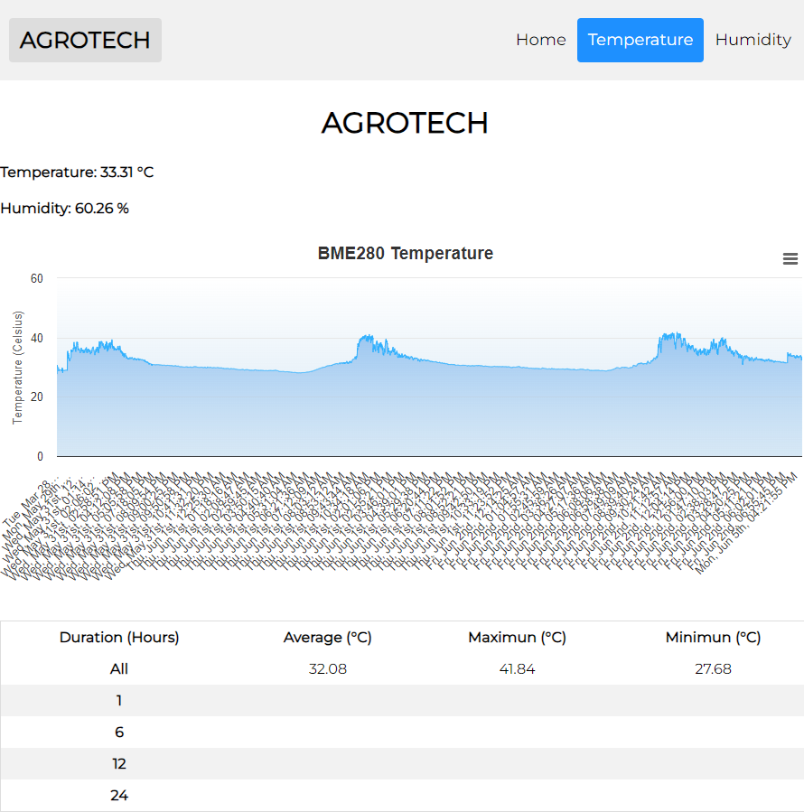

# AgroTech: Android & Web App with ESP32/ESP8266

AgroTech is a project that combines an Android application, a Web application, and a Wi-Fi-enabled microcontroller (ESP32/ESP8266) with a BME280 sensor. The project focuses on providing temperature and humidity data in an agricultural setting. The Android application offers a WebView for displaying web content, while the web app enables users to view sensor data, set thresholds, and receive notifications. The ESP32/ESP8266 microcontroller collects sensor readings and sends them to the server via Wi-Fi.

## Repository Structure

The repository contains the following files:

### Android Application:

- `MainActivity.java`: Represents the main activity of the Android application. It initializes the WebView, loads a web page, and handles navigation through the bottom navigation view.
- `HumActivity.java`: Represents the activity for displaying humidity information. It contains a WebView and handles navigation through the bottom navigation view.
- `TempActivity.java`: Represents the activity for displaying temperature information. It contains a WebView and handles navigation through the bottom navigation view.

### ESP32/ESP8266 Wi-Fi Sensor:

- `bme280.ino`: The main Arduino sketch that runs on the ESP32 or ESP8266 microcontroller. It connects to Wi-Fi, initializes the BME280 sensor, and sends sensor readings to a server using HTTP POST requests.

### Web App:

- `agrotech.php`: Home page that provides an overview of AgroTech and its functionalities.
- `agrotechtemp.php`: Retrieves temperature data from the Sensor table in the database and displays it in a web interface. It also calculates and displays statistics for the sensor data over different periods.
- `agrotechhum.php`: Retrieves humidity data from the Sensor table in the database and displays it in a web interface. It also calculates and displays statistics for the sensor data over different periods.
- `api.php`: Retrieves temperature and humidity data from the Sensor table in the database and returns the data in JSON format.
- `data.php`: Receives temperature and humidity data from an external device, validates it, and stores it in the Sensor table of the database.
- `delete.php`: Deletes a record from the EmailData table in the database based on the provided ID. It also resets the auto-increment value and updates the ID column in the EmailData table.
- `email.php`: Checks the latest temperature and humidity values against the threshold values in the EmailData table. If the values exceed the thresholds, an email is sent.
- `emaildb.php`: Handles the addition of data to the EmailData table in the database. It receives data through an HTTP POST request and inserts it into the table.

## Installation

Follow the installation instructions below to set up each component of the AgroTech project.

### Android Application:

1. Clone the repository: `git clone https://github.com/Arahat002/AgroTech.git`
2. Open the project in Android Studio.
3. Build and run the application on an Android device or emulator.

### ESP32/ESP8266 Wi-Fi Sensor:

1. Clone the repository: `git clone https://github.com/Arahat002/AgroTech.git`
2. Open the `bme280.ino` file in the Arduino IDE.
3. Configure the sketch with your Wi-Fi credentials and server details.
4. Compile and upload the sketch to your ESP32 or ESP8266 microcontroller.

### Web App:

1. Clone the repository: `git clone https://github.com/Arahat002/AgroTech.git`
2. Set up a web server with PHP support.
3. Create a MySQL database and import the provided SQL file.
4. Create the `EmailData` table by executing the following SQL query:
```sql
CREATE TABLE EmailData (
  id INT AUTO_INCREMENT PRIMARY KEY,
  email VARCHAR(255) NOT NULL,
  thresholdtemp_above DECIMAL(4,1) NOT NULL,
  thresholdtemp_below DECIMAL(4,1) NOT NULL,
  thresholdhum_above INT NOT NULL,
  thresholdhum_below INT NOT NULL
);
```
5. Create the `Sensor` table by executing the following SQL query:
```sql
CREATE TABLE Sensor (
    id INT(6) UNSIGNED AUTO_INCREMENT PRIMARY KEY,
    value1 VARCHAR(10),
    value2 VARCHAR(10),
    value3 VARCHAR(10),
    reading_time TIMESTAMP DEFAULT CURRENT_TIMESTAMP ON UPDATE CURRENT_TIMESTAMP
);
```
6. Update the database connection credentials in the PHP files (`agrotech.php`, `emaildb.php`).
7. Open `agrotech.php` in a web browser to access the AgroTech dashboard.

## Usage

### Android Application:

- Launching the application loads a web

 page specified by the `TEST_PAGE_URL` constant in the WebView.
- Use the bottom navigation view to navigate between different sections of the application:
  - Home: Displays the WebView with the loaded web page.
  - Temperature: Navigates to the TemperatureActivity.
  - Humidity: Navigates to the HumidityActivity.
- Additional features, such as handling page loading events, title updates, and external page requests, are also implemented.

### ESP32/ESP8266 Wi-Fi Sensor:

1. After uploading the code to your ESP32 or ESP8266 board, open the serial monitor at a baud rate of 9600 to view the sensor readings and WiFi connection status.
2. The sensor readings will be sent to the server every 30 seconds via HTTP POST requests.

### Web App:

- The homepage (`agrotech.php`) displays the current temperature and humidity readings.
- Clicking on the "Temperature" and "Humidity" links in the header allows viewing historical data.
- Clicking on the "Add Email" button opens a modal for adding an email address and threshold values.
- Fill in the required fields in the modal and click "Submit" to add the email address and thresholds to the database.
- Notifications will be sent when the temperature or humidity readings exceed the specified thresholds.
- The application automatically updates the sensor data and statistics each time it is accessed.

## Screenshots

### Android Application:

| Home Page  | Temperature Page |
| ------------- | ------------- |
| |  |

### Web App:

| Home  | Add Email | Temperature Page |
| ------------- | ------------- | ------------- |
|   |   |   |


## Contributing

Contributions to this project are welcome! If you find any issues or have suggestions for improvements, please open an issue or submit a pull request.

## License

This project is licensed under the Apache License 2.0. See the [LICENSE](LICENSE) file for more details.
